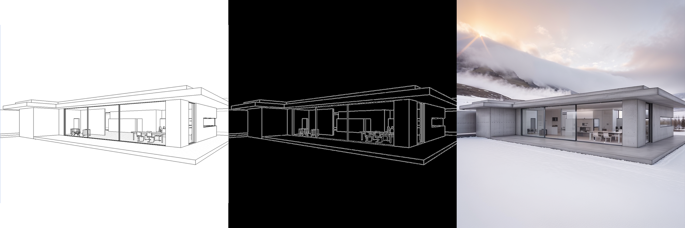

# Sketch to Renderer

Небольшой проект для генерации финального изображения по эскизу при помощи
Stable Diffusion ControlNet. Исходный код организован в пакете `renderer`,
а скрипт `generate.py` предоставляет CLI для запуска.

## Подготовка окружения (Windows 11, Python 3.10+, CUDA 12.8)

### Требования
1. CUDA Toolkit 12.8 и драйверы NVIDIA
2. Установленный Python 3.10, 3.11 или 3.12
3. Активное виртуальное окружение и установленный PyTorch с поддержкой CUDA

### Шаги
0. Убедитесь, что CUDA доступна:
   ```cmd
   nvidia-smi
   nvcc --version
   ```
1. Создайте виртуальное окружение:
   ```cmd
   python -m venv venv
   venv\Scripts\activate
   ```
2. Обновите `pip`:
   ```cmd
   python -m pip install --upgrade pip
   ```
3. Установите зависимости проекта:
   ```cmd
   pip install -i https://download.pytorch.org/whl/cu128 --extra-index-url https://pypi.org/simple -r requirements.txt
   ```
   >Если присутствует файл `requirements.lock`:
   >```cmd
   >pip install -r requirements.lock
   >```
4. Проверки:
   ```cmd
   python -c "import torch; print(torch.__version__)"
   python -c "import torch; print(torch.cuda.is_available())"
   ```
5. Сохраните список установленных пакетов:
   ```cmd
   pip check
   pip freeze > requirements.lock
   ```
6. Скачайте модели `SG161222/Realistic_Vision_V6.0_B1_noVAE`, `lllyasviel/control_v11p_sd15_canny` и `stabilityai/sd-vae-ft-ema` из Hugging Face и разместите их в каталоге `models/`.
   При необходимости можно подключить дополнительные LoRA адаптеры. Их
   пути и параметры указываются в файле `config.yaml`.

### Рекомендуемые модели
1. **Базовая** — `SG161222/Realistic_Vision_V6.0_B1_noVAE`
2. **ControlNet** — `lllyasviel/control_v11p_sd15_canny`
3. **VAE** — `stabilityai/sd-vae-ft-ema`

Модели можно загрузить через `huggingface-cli`:
```bash
huggingface-cli download SG161222/Realistic_Vision_V6.0_B1_noVAE --local-dir models/Realistic_Vision_V6.0_B1_noVAE
huggingface-cli download lllyasviel/control_v11p_sd15_canny --local-dir models/control_v11p_sd15_canny
huggingface-cli download stabilityai/sd-vae-ft-ema --local-dir models/sd-vae-ft-ema
```
После загрузки укажите пути в `config.yaml` либо используйте оригинальные ссылки на Hugging Face.

Все параметры генерации задаются в файле `config.yaml`.

### Конфигурация
Ниже приведены основные параметры `config.yaml` и соответствующие ключи CLI.

| Ключ | Тип | Пояснение | CLI параметр |
|------|-----|-----------|--------------|
| `model.base` | str | Базовая модель Stable Diffusion | — |
| `model.controlnet` | str | Модель ControlNet | — |
| `model.vae` | str | Используемый VAE | — |
| `loras` | list | Список LoRA‑адаптеров | — |
| `prompt` | str | Текст подсказки | `--prompt` |
| `negative_prompt` | str | Негативная подсказка | `--negative-prompt` |
| `preprocess_size` | int | Размер входного изображения | `--preprocess-size` |
| `canny.low` | int | Нижний порог Canny | `--canny-low` |
| `canny.high` | int | Верхний порог Canny | `--canny-high` |
| `controlnet_conditioning_scale` | float | Сила ControlNet | `--controlnet-scale` |
| `num_inference_steps` | int | Число итераций диффузии | `--steps` |
| `guidance_scale` | float | CFG scale | `--guidance` |
| `input` | str | Путь к исходному эскизу | `--input` |
| `output` | str | Имя итогового файла | `--output` |

## Запуск
Для просмотра всех параметров вызовите:
```cmd
python generate.py --help
```

Базовый пример:
```cmd
python generate.py --input sketch.png --prompt "<ваш промпт>"
```

Можно переопределить любой параметр конфигурации через CLI:
```cmd
python generate.py --config config.yaml --input input.png \
    --prompt "modern house" --output result.png
```

При запуске без явного указания пути `--output` скрипт
создаст каталог `runs/YYYYMMDD_HHMMSS`, где будут сохранены сгенерированное
изображение (`output.png`) и все отладочные изображения.

CLI использует `config.yaml` как источник значений по умолчанию.

## Пример результата

Ниже показано изображение `output.png`, полученное при генерации со стандартными
настройками:

